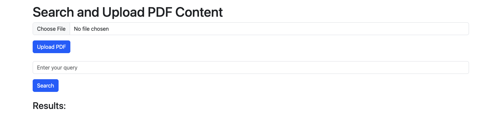
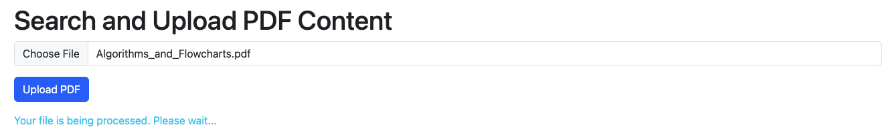
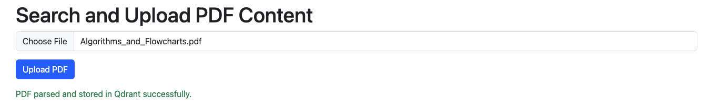
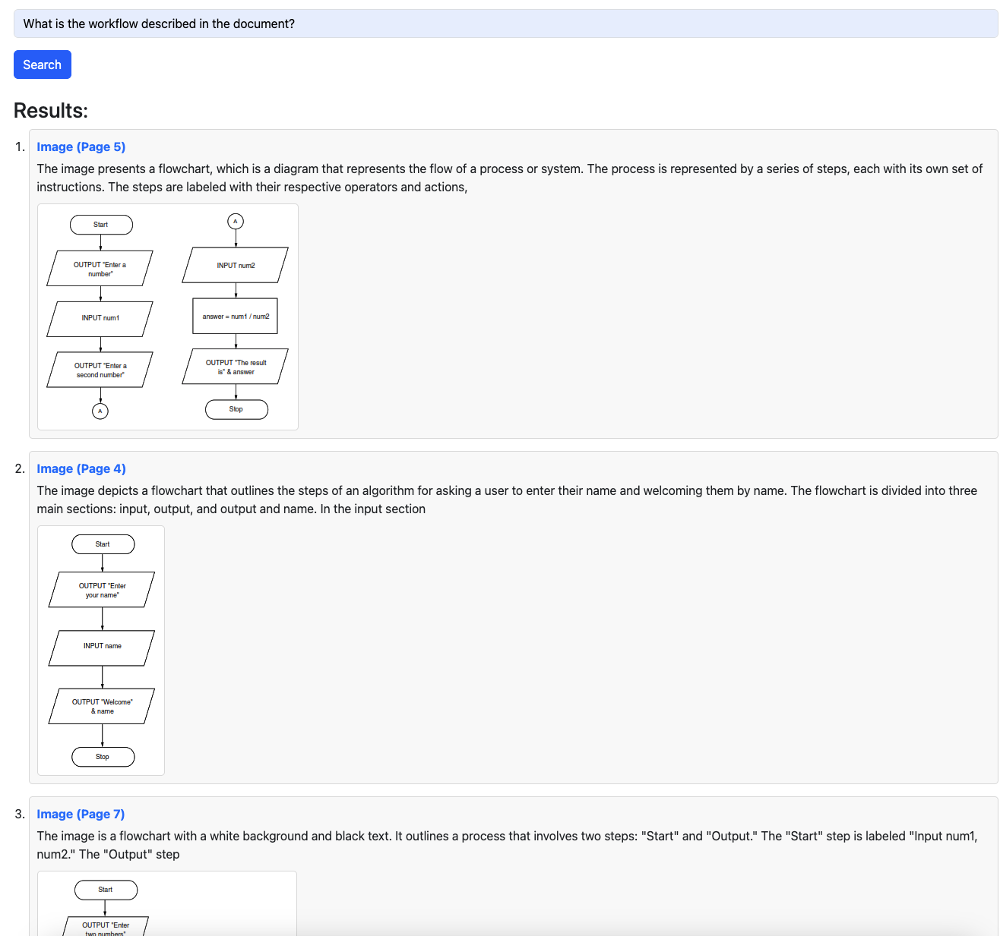

# PDF Content Extractor and Query

This project is a PDF content extraction and query system that allows users to upload PDF files, process their content, and perform queries using **Qdrant** to retrieve results. The application supports the extraction and display of **paragraphs**, **images**, and **tables** with relevant metadata.

## 1. Setup Environment

1.1 Clone this repostoriy

````bash
git clone git@
````

1.2 It is recomended to create a virtual environment for the system. I am using Conda with python 3.9.20

````bash
conda create -n pdfenv python==3.9.20
````

1.3 Activate the virtual environment

````bash
conda activate pdfenv
````

1.4 Install all dependencies

````bash
pip install -r requirements.txt
````

1.5 Install Docker on your computer [here](https://docs.docker.com/engine/install/)

1.6 Running Qdrant locally [documentation](https://qdrant.tech/documentation/quickstart/)

First, download the latest Qdrant image from Dockerhub:

````bash
docker pull qdrant/qdrant
````

Then, run the service:

````bash
docker run -p 6333:6333 -p 6334:6334 \
    -v $(pwd)/qdrant_storage:/qdrant/storage:z \
    qdrant/qdrant
````

## 2. Running the system

````
cd
python main.py
````

## 3. Documentation

3.1 PDF parsing

I am using pymupdf and pdfplumber to extract all content from the PDF file. More spcifically, I used pymupdf to extract all text (paragraphs) and images. I used pdfplumber to extract all tables.

Difficulties Encountered During Implementation:

- Paragraphs that belong to the same subtitle is not well-organized.
- Images caption need to be generated.
- Tables are very hard to extract from the parsed data using eith libraies.

Solutions:

- "pymupdf" provided efficient tools retunring all blocks on the page. Based on their font-size, I reconstruct all paragraphs making them well-organized based on under their sections (subtitle).
- I employed a Image Caption Model to automatically generate the caption for the image. To enhance the clarity and accuracy, I additionally include the context information (e.g., the paragraph before the image) to make the caption accurate. (Image caption model used: "llava-hf/llava-interleave-qwen-0.5b-hf" avaliable on Huggingface, it is a small size model allowing both image and text input.)
- Tables are a little bit hard to extract. Currently, I found all tables have a short description before it. So I developed logic to extract the last sentence before the table using pdfplumber. If the description exists, the extracted table is considered as a valid table, otherwise, it is considered as invalide table.

3.2 Storing all data into Qdrant

Qdrant is a vector similarity search engine that stores vectors as keys to calculate similarity for retrieval purposes. To achieve, I used sentence embedding models to generat embedding vectors for all extracted data (e.g., paragraph, caption for images,  description for tables). The model I selected is "sentence-transformers/all-MiniLM-L6-v2" available on Huggingface.

3.3 Retrieving data based on user query

User can input query for retrieving relevant content from the PDF. The user query is embedded using the same embedding model for similarity calculation. The system will retunr top-5 candidates based on their cosine similarity.

## 4. Step-by-Step Demo

4.1 Open the interface in the browser.



4.2 Choose and Upload the target pdf file.



4.3 Wait the parsing process is completed.



4.4 Input query for searching

**Query 1: "What is the workflow described in the document?"**



**Query 2: Show me the table containing the common comparison operators.**


**Query 3: What is repeat until loop?**

